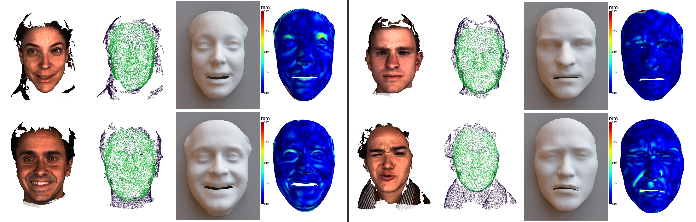

# Shape My Face: Registering 3D Face Scans by Surface-to-Surface Translation

## Paper

Arxiv: https://arxiv.org/abs/2012.09235

Status: In Review (minor revision on round 1) with IJCV.

## Code coming soon
