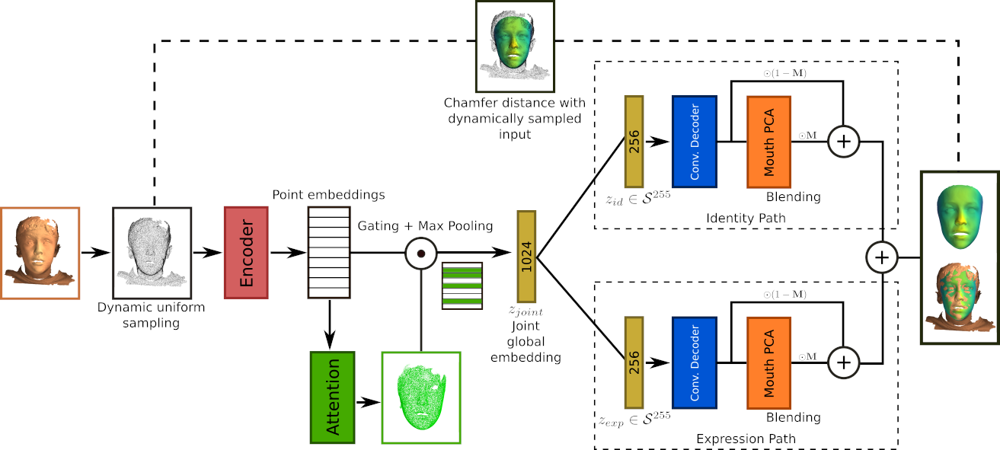

# Shape My Face: Registering 3D Face Scans by Surface-to-Surface Translation

## Paper

Arxiv: https://arxiv.org/abs/2012.09235

Status: In Review (minor revision on round 1) with IJCV.

## The method

Shape My Face (SMF) is a point cloud to mesh auto-encoder for the registration of raw human face scans, and the generation of synthetic human faces. SMF leverages a modified PointNet encoder with a visual attention module and differentiable surface sampling to be independent of the original surface representation and reduce the need for pre-processing. Mesh convolution decoders are combined with a specialized PCA model of the mouth, and smoothly blended based on geodesic distances, to create a compact model that is highly robust to noise. SMF is applied to register and perform expression transfer on scans captured in-the-wild with an iPhone depth camera represented either as meshes or point clouds.

## Code coming soon
